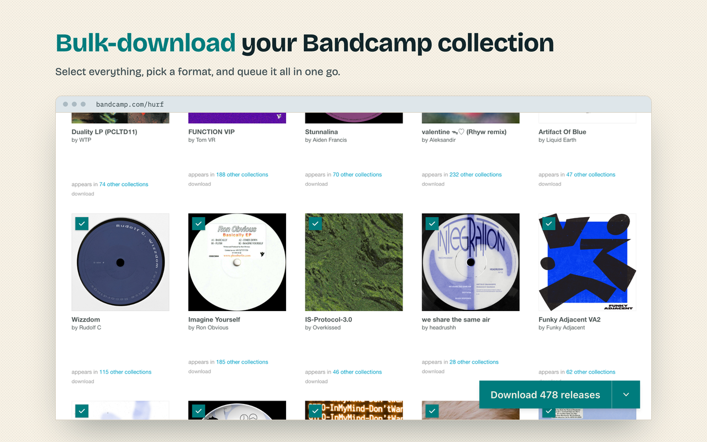
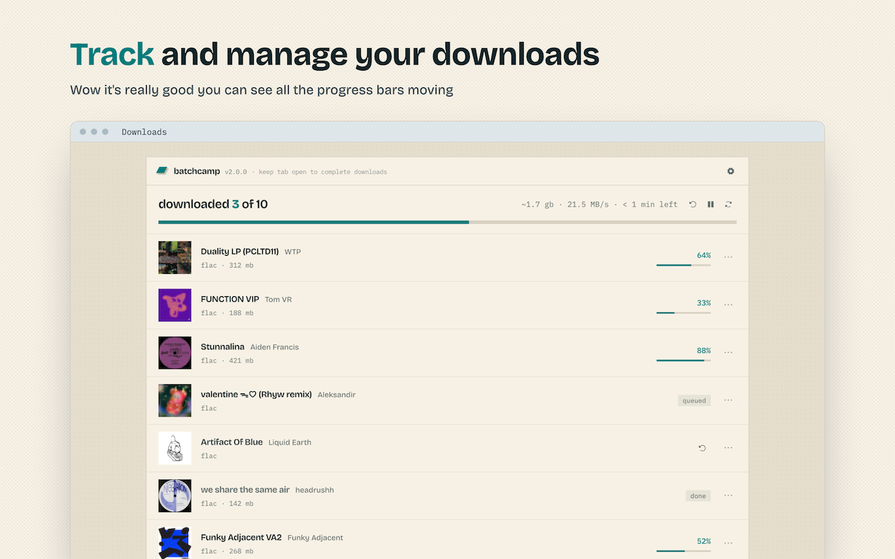

# Batchcamp

A Chrome and Firefox extension for bulk-downloading your Bandcamp collection in any format.

Batchcamp is ideal if you:

- Buy multiple releases during Bandcamp Fridays, or full discographies
- Want to download your collection in different formats or for offline listening
- Need to recover or back up your entire music library
- Manage large amounts of music for DJing or archiving

## Features

- Select releases across your collection or purchases page and queue them all at once
- Downloads in any format Bandcamp offers: MP3, FLAC, WAV, AIFF, ALAC, AAC, Ogg Vorbis
- Marks releases you've already downloaded, so you only grab what's missing
- Saves cover art and names files with templates like `{artist} - {title}`
- A downloads tab where you can pause, resume, retry, reveal in folder, or copy links

## Usage

1. Go to your Bandcamp collection or purchases page
2. Tick the releases you want (shift-click selects a range)
3. Hit Download

Select All loads and selects your whole collection. If you've used Batchcamp before, the same menu has an Undownloaded option for just the releases you're missing. The dropdown next to the Download button picks a format for a single batch without changing your default.

## Installation

- [Chrome](https://chrome.google.com/webstore/detail/batchcamp/jfcffbaekgnenlohblfgpohgdhalgjeb)
- [Firefox](https://addons.mozilla.org/en-GB/firefox/addon/batchcamp/)

Or build it from source:

```bash
pnpm install
pnpm build-chrome
```

## Big Room Tech House DJ Tool - TIP(s)!

Your browser might ask where to save each file. Turn that off under "Ask where to save each file before downloading" in Chrome, or "Always ask me where to save files" in Firefox, and the queue will run unattended.

## Screenshots




